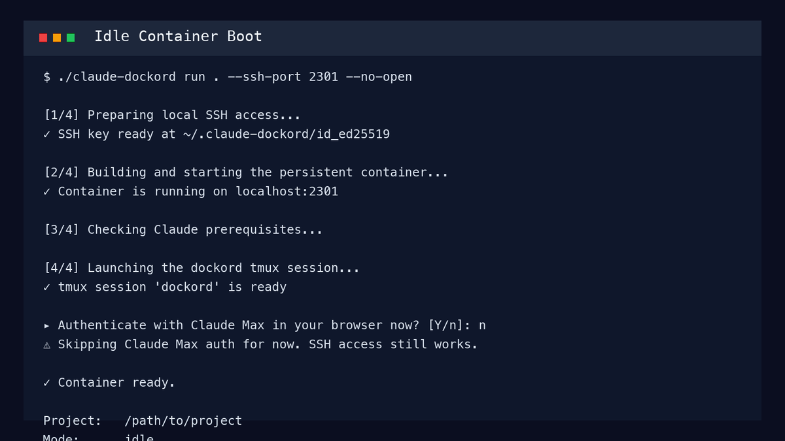
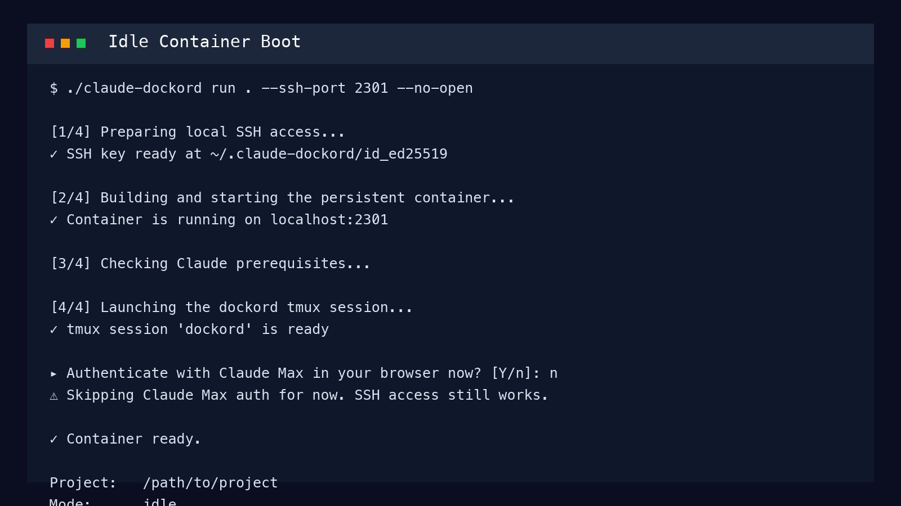
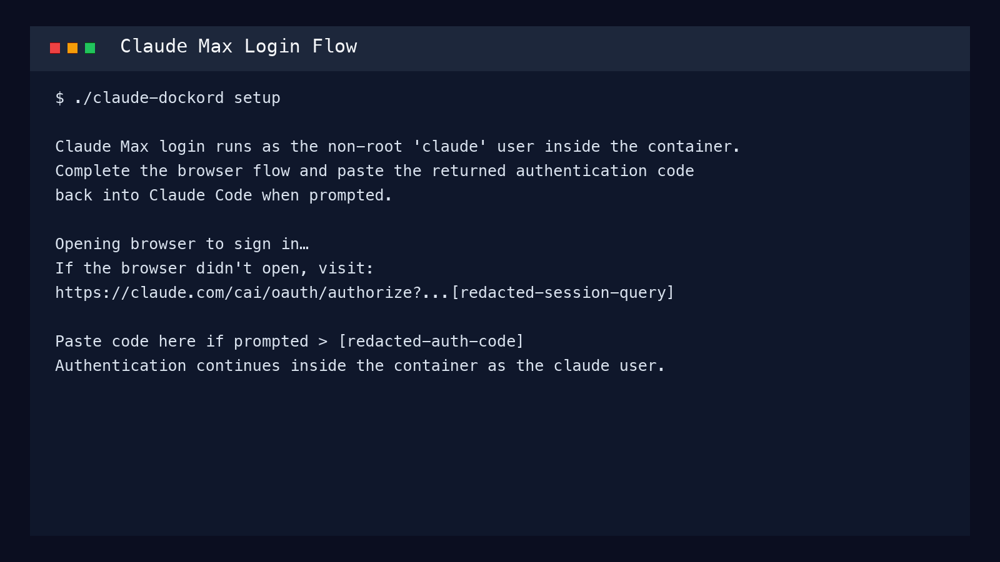
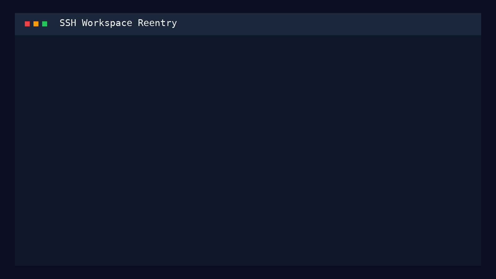

# claude-dockord

Persistent Docker orchestration for Claude Code. One command boots a production-style agent container on your machine, mounts your repo, wires in the Ralph loop and project templates, and leaves you with a stable SSH entrypoint for follow-up work.

This repo is meant to showcase a disciplined Staff-level workflow:

- isolated container runtime instead of letting `--dangerously-skip-permissions` touch the host
- persistent tmux-backed sessions instead of disposable one-shot shells
- Ralph-first autonomous execution when you provide a prompt
- SSH-first handoff when you want the container to wait for manual direction
- browser-based Claude Max authentication instead of API-style usage
- explicit git hygiene, logging, tests, and docs around the automation itself

## Quick Start

```bash
# Optional first-time setup: build image, start container, authenticate Claude Max
./claude-dockord setup

# Boot a project container. Leave the prompt blank to start idle and SSH in later.
./claude-dockord run ~/code/my-app

# Kick off a Ralph loop immediately
./claude-dockord run ~/code/my-app --ralph "implement JWT auth with refresh tokens"

# Add supporting context for the first task
./claude-dockord run ~/code/my-app \
  --task "triage the failing integration tests" \
  --source "docs/spec.md" \
  --source "https://internal.example.com/runbook"
```

`run` now does the heavy lifting. It builds or refreshes the image, starts the long-lived container, mounts the target repo, ensures SSH access on `localhost`, launches a `tmux` session inside the container, and prints the exact SSH command you can reuse later.

If you provide an initial prompt, the work starts immediately in `tmux`. If you leave it blank, the container idles and waits for you to connect over SSH and give instructions manually.

If Claude Max credentials are missing, dockord hands control to `claude auth login --claudeai` inside the container. You complete the browser-based flow and, if Claude Code asks for it, paste the returned authentication code back into the interactive CLI. It does not rely on API keys or Anthropic API billing.

## Proof

The repo includes generated proof assets from a verified local run of the current flow.



Idle boot and SSH handoff:



Manual Claude Max login flow:



Interactive SSH re-entry into the mounted workspace:



Regenerate the media locally with:

```bash
bash ./scripts/render-proof-media.sh
```

## Interactive Flow

`./claude-dockord run <path>` opens an interactive flow with three decisions:

1. Optional initial prompt/spec.
2. Optional supporting source, path, URL, or note.
3. Optional immediate launch into Ralph, agent-team kickoff, fire-and-forget, or auto-restart mode.

If you skip the prompt, dockord boots an idle container and prints:

- the direct SSH command
- the `tmux` attach variant
- an optional “open a new terminal and connect now” action on supported hosts

On macOS this uses `Terminal.app` via AppleScript. On Linux it falls back to `x-terminal-emulator`, `gnome-terminal`, or `konsole` when available.

When Claude Max auth is needed, the CLI pauses in Claude Code's own login flow. The container stays on the `claude` user, the browser opens from that flow, and you can paste the one-time auth code back into the terminal if Claude prompts for it.

## What It Does

```
You run one command. Then:

1. Docker builds or refreshes the Claude image
2. A persistent container starts with SSH on localhost and tmux inside
3. Your project is mounted at /workspace
4. CLAUDE.md, Ralph config, progress tracker, and hook docs are bootstrapped
5. A tmux session named dockord is created for the current run
6. If you supplied a prompt, Claude/Ralph starts immediately in that tmux session
7. If you skipped the prompt, the container stays idle and waits for SSH instructions
8. The CLI prints reusable SSH and tmux attach commands
9. Agent logs and Claude auth persist in named Docker volumes
10. The same container can be re-entered whenever you want
```

## Why This Shape

**Persistent instead of disposable**

The old flow used `docker compose run --rm`, which made `attach`, `monitor`, and later re-entry unreliable. A persistent service matches the actual operating model you described: boot once, keep working, reconnect later.

**SSH on localhost**

The container exposes `sshd` only on `127.0.0.1` and only allows public-key auth for the `claude` user. That gives you a stable entrypoint without exposing the container to the network.

**tmux as the execution substrate**

Immediate Claude/Ralph work runs in a named `tmux` session. That lets the container stay alive after kickoff, gives you something concrete to attach to, and keeps the Ralph loop compatible with a reconnectable environment.

**Ralph stays central**

If you provide a prompt interactively, Ralph is the default launch mode. Fire-and-forget, agent kickoff, and auto-restart are still available, but the autonomous Ralph loop remains the first-class path.

**Claude Max, not API keys**

This flow is built around Claude Code’s web-based `claude auth login --claudeai` path so the container can use your Claude Max plan. There is no `.env` API-key setup in the product flow.

## CLI Reference

| Command | Description |
| --- | --- |
| `claude-dockord setup` | Build/start the container, authenticate Claude, and leave an idle session ready |
| `claude-dockord run <path> [opts]` | Start or refresh the persistent container for a project |
| `claude-dockord monitor` | Run `ccusage blocks --live` inside the container |
| `claude-dockord logs` | List persistent agent activity logs |
| `claude-dockord log <file>` | Read a single activity log safely by basename |
| `claude-dockord export-logs` | Copy logs to `./agent-logs-export/` |
| `claude-dockord status` | Show compose status plus the last SSH command |
| `claude-dockord attach` | Attach to the `dockord` tmux session |
| `claude-dockord teardown` | Stop the container and keep image/volumes |
| `claude-dockord nuke` | Remove container, image, and named volumes |

### Run Options

| Flag | Description |
| --- | --- |
| `--ram <size>` | Container memory limit, default `16g` |
| `--task <prompt>` | Start a one-shot Claude prompt in tmux |
| `--ralph <prompt>` | Start a Ralph loop in tmux |
| `--ralph-iter <n>` | Override Ralph iteration cap, default `30` |
| `--agents <prompt>` | Kick off a Claude session intended to orchestrate agent teams |
| `--auto <prompt>` | Start the rate-limit auto-restart wrapper |
| `--source <value>` | Add supporting context to the initial prompt |
| `--ssh-port <port>` | Prefer a specific localhost SSH port |
| `--no-open` | Skip the “open a new terminal” step |
| `--rc` | Remind you to run `/rc` after connecting |

## Security Notes

- SSH binds to `127.0.0.1` only.
- Password auth and root SSH login are disabled.
- Only the generated local public key is authorized by default.
- Git trust is scoped to `/workspace` and `/worktrees` inside the container (no global `safe.directory=*`).
- The CLI now rejects path traversal when reading exported log files.
- Hook configuration is merged without overwriting unrelated `settings.local.json` hook data.

This is still an intentionally permissive agent container. Claude runs with `--dangerously-skip-permissions`, and the `claude` user keeps passwordless `sudo` inside the container. The point is to constrain that risk to the mounted project and named Docker volumes, not to pretend the runtime is sandboxed internally.

## Architecture

```
┌─────────────────────────────────────────────────────────────────┐
│  Host Machine                                                   │
│                                                                 │
│  ./claude-dockord run ~/code/my-app                             │
│           │                                                     │
│           ▼                                                     │
│  Docker Compose service: claude-dockord                         │
│  ┌───────────────────────────────────────────────────────────┐  │
│  │  Persistent container                                      │  │
│  │                                                           │  │
│  │  /workspace   ← bind mount of your repo                   │  │
│  │  /worktrees   ← named volume for branch isolation         │  │
│  │  /agent-logs  ← named volume for plans and activity logs  │  │
│  │                                                           │  │
│  │  sshd on localhost:<port>                                 │  │
│  │  tmux session: dockord                                    │  │
│  │  Claude / Ralph runs inside tmux                          │  │
│  │                                                           │  │
│  │  Templates copied on first boot:                          │  │
│  │  CLAUDE.md, .ralphrc, progress.txt, docs/, hooks/         │  │
│  └───────────────────────────────────────────────────────────┘  │
└─────────────────────────────────────────────────────────────────┘
```

## File Structure

```
├── claude-dockord
├── Dockerfile
├── docker-compose.yml
├── entrypoint.sh
├── Makefile
├── lib/
│   ├── auth.sh
│   ├── open-terminal.sh
│   ├── session.sh
│   └── ui.sh
├── proofs/
│   ├── dockord-proof.gif
│   ├── idle-flow.png
│   ├── oauth-browser-launch.png
│   ├── ssh-workspace.png
│   └── transcripts/
├── scripts/
│   ├── launch-session.sh
│   └── render-proof-media.sh
├── templates/
│   ├── CLAUDE.md
│   ├── .ralphrc
│   ├── progress.txt
│   ├── auto-restart.sh
│   ├── docs/
│   └── hooks/
└── tests/
    ├── auth_test.sh
    ├── cli_test.sh
    ├── entrypoint_test.sh
    ├── helpers.sh
    ├── hook_test.sh
    ├── run.sh
    ├── session_test.sh
    └── ui_test.sh
```

## Verification

The repo now includes shell-level regression tests:

```bash
./tests/run.sh
```

Those cover:

- shell syntax across the host and container scripts
- Claude Max auth delegation to Claude Code's own login flow
- prompt construction
- SSH command generation
- run-flag validation (missing values, conflicting modes, invalid `--ssh-port`, invalid `--ralph-iter`)
- session-state persistence
- log filename sanitization
- SSH port selection behavior
- container git trust hardening for `safe.directory`
- post-tool hook README reminders for shell source changes

## Requirements

- Docker Desktop or another working Docker daemon
- Claude Code CLI access (`@anthropic-ai/claude-code` is installed in the image)
- Claude Max authentication via browser-based `claude auth login`

## License

MIT
